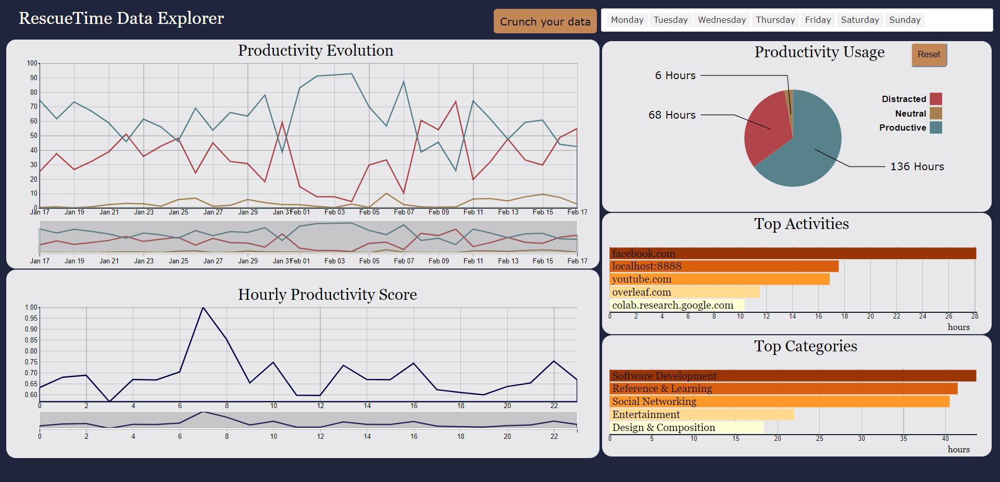
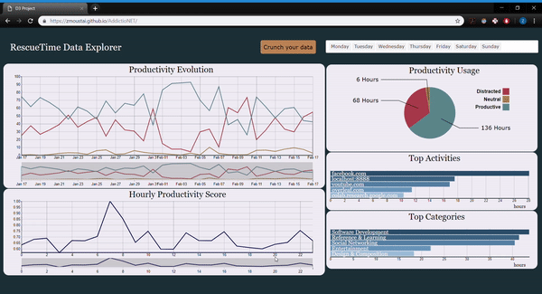

# AddictioNET
***JABRI Mhamed, MOUSTAINE Zakariae et SAHRAOUI Ahmed**  - 03/2019*
***

## Pourquoi ?
Nous passons énormement de temps sur internet chaque jour, que cela soit pour des besoins académiqus / professionnels ou pour se divertir en jouant ou en regardant une série. Par conséquent, il est parfois difficile de prendre du recul et réaliser si notre activité devant est souvent nécessaire (productivité) ou plutôt le contraire. 

Nous avons donc décidé de mettre en place **AddictioNET** : un dashboard interactif qui utilise les données recueillies par [RescueTime](https://www.rescuetime.com/) pour analyser notre utilisation et visualiser le temps passé sur chaque catégorie d'activités ou de façon plus granulaire, sur chaque activité.      
Ces visualisations ont pour but de fournir une idée globale mais aussi précise sur notre gestion de temps sur ordinateur pour pouvoir prendre des mesures et optimiser notre utilisation. 

  

## Visualisations
L'application que nous avons développé permet d'avoir un aperçu qualitatif et quantitatif sur le temps passé sur sa machine. Ceci se fait à travers cinq graphiques différents : 
* Le premier, en haut à gauche, permet de représenter l'évolution temporelle (quotidienne) des trois grandes catégories d'activités, à savoir les activités productives, distractives et neutres.             
* Concernant le deuxième qui est en bas à gauche, il permet de tracer la moyenne du score de productivité par heure. Pour comprendre comment ce score est calculé, donnons-un exemple simple : Si entre 18h et 19h vous passez 40 minutes sur une activité productive, 10 minutes sur une activité distractive et 10 sur une activité neutre, alors votre score pour cette heure est : 1 x 0.66 + 0.5 x 0.16 + 0 x 0.16. Nous effectuons ensuite une moyenne sur tous les scores entre 18h et 19h pour afficher le score de cette heure.
* Le troisième, en haut à droite, est un camembert (pie chart) montrant la répartition moyenne des trois catégories précédentes sur l'ensemble des données chargées, tout en quantifiant cela en terme d'heures devant l'écran.
* Le quatrième est un graphique à barres horizontales qui montre un classement des applications les plus utilisées avec la durée totale passée pour chacune d'elles.
* Sur le dernier, qui est un graphique à barres horizontales, on peut voir les sous-catégories dans lesquelles on passe le plus de temps, avec la durée totale passée pour chacune d'elles.

## Fonctionnalités

### Filtres
L'application contient deux types de filtres différents.        
* Une barre permettant de spécifier les jours de la semaine à inclure pour l'analyse. Cela permet par exemple d'exclure les weekends si l'utilisateur s'intéresse principalement à son activité en milieu de semaine.     
* On peut également, sur la légende du camembert, cliquer sur une des trois catégories (**Distracted**, **Neutral** et **Productive**) pour ne visualiser que les activités et sous-catégories qui sont du type sélectionné. Cela est particulièrement utile pour trouver le top 5 des activités distractives dans notre quotidien et leur volume horaire.

### Zoom
En dessous des deux visualisations temporelles (*Productivity Evolution* et *Hourly Productivity Score*), on trouve des sliders qui permettent de séléctionner : 
* Dans le premier cas, la plage de jours sur lesquels on veut effectuer l'analyse (cela modifie le reste des visualisations) 
* Dans le deuxième cas, la plage horaire qui nous intéresse. Le reste des graphes (mis à part le premier) sont mis à jour pour n'afficher que l'activité comprise dans cette plage horaire.

### Démonstration des fonctionnalités                             
Le gif ci-dessous permet de voir les fonctionnalités décrites en action :

  

## Ressources utilisées
- [Interactive Data Visualization course (ECL MOS 5.5) - Romain Vuillemot](https://github.com/LyonDataViz/MOS5.5-Dataviz)
- [Horizontal Bar Chart with specific informations](https://bl.ocks.org/alandunning/7008d0332cc28a826b37b3cf6e7bd998?fbclid=IwAR3rObL7VjqSWmA8a51X4M6Jl0S_F8u5RiicRGZsaT6w9JrC9ava9lBrKgo)
- [Line Charts with zoom](http://bl.ocks.org/natemiller/7dec148bb6aab897e561?fbclid=IwAR07dlGfEBKmKcQl-No6vZOvh1iGqcdorWoKE-ZHbuj1H_-4AIJKuRUqn2g)
- [Onboarding for the visualizations](https://github.com/usablica/intro.js)
- [Selectize.js](https://selectize.github.io/selectize.js/) 
